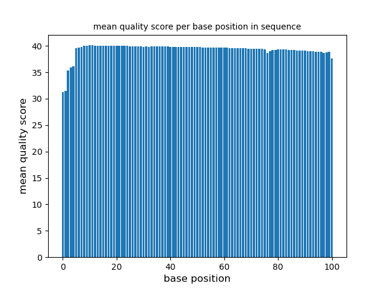
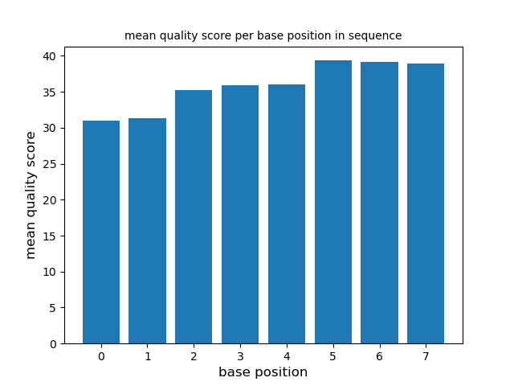
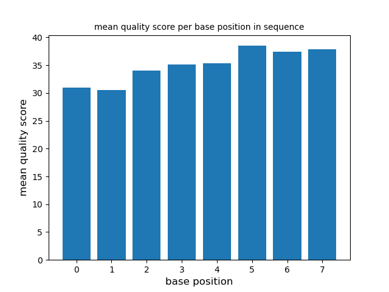
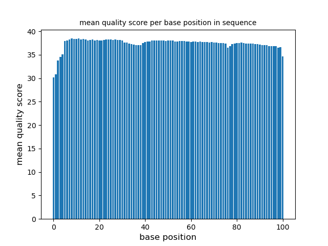

# Assignment the First

## Part 1
1. Be sure to upload your Python script. Provide a link to it here:

[qualscoretohisto.py](https://github.com/Ike-Sanderson/Demultiplex/blob/master/Assignment-the-first/qualscoretohisto.py)

| File name | label | Read length | Phred encoding |
|---|---|---|---|
| 1294_S1_L008_R1_001.fastq.gz | R1 | 101 | 33 |
| 1294_S1_L008_R2_001.fastq.gz | R2 |   8 | 33 |
| 1294_S1_L008_R3_001.fastq.gz | R3 |   8 | 33 |
| 1294_S1_L008_R4_001.fastq.gz | R4 | 101 | 33 |

2. Per-base NT distribution
    1. Use markdown to insert your 4 histograms here.
  
       This is the histogram for R1
       
      

       This is the histogram for R2
   
      

        This is the histogram for R3
   
      

        This is the histogram for R4
   
      
       
    3. The index cutoff score should be high for the index reads; those need to be correct. Looking at the histogram for the R2
       and R3 average I see that the first couple of positions have lower average scores: around 30. I would like to do a run
       with the cutuff at, say 32 and another with the cutoff at 35 (or 36?) and see if we get enough usable/matched reads
       with 36 to do a BLAST construct. For the R1 and R4 files, the average is quite high for most positions and perhaps a
       score cutoff of 28 is enough to keep out the garbage if there is any. The aligning tool should be able to do its job
       and give us a good guess at contigs even if a few bases are poor. At least that's what I think having never really done           this before.
    4. Looking at the symbols, there's no way the encoding could be anything other than Phred 33. It cannot be Phred 64 because          there are values less than 64 ( e.g. '#' which has a score of 2)
    
## Part 2
1. Define the problem
   The problem is that the files were the product of a multiplexed output because the lanes can take so many different experimental results and output the data for each of those experiments. The data need to be separated into different reads by index. 
2. Describe output
   The output will consist of two files for each index (one for the forward read and one for the reverse read) plus two files of unknown or low quality reads, plus two files for index hopped reads. Should be a total of 52 files in this case as we have 24 indices unless for some reason there are no high quality properly mapped reads corresponding to one or more of the indices.
3. Upload your [4 input FASTQ files](../TEST-input_FASTQ) and your [>=6 expected output FASTQ files](../TEST-output_FASTQ).
   
4. [Pseudocode](https://github.com/Ike-Sanderson/Demultiplex/blob/master/demultiplexalgorithm.txt)
    Note: I made three sets of 4 so that I could better isolate whether my script for the three cases (matched, unknown,
   index hopped) is specifically working. If necessary, it will be easy to copy/paste into a single file. There are four
   folders in "Assignment_the_second" directory" with these files and the expected output
6. High level functions. For each function, be sure to include:
    1. Description/doc string
    2. Function headers (name and parameters)
    3. Test examples for individual functions
    4. Return statement
